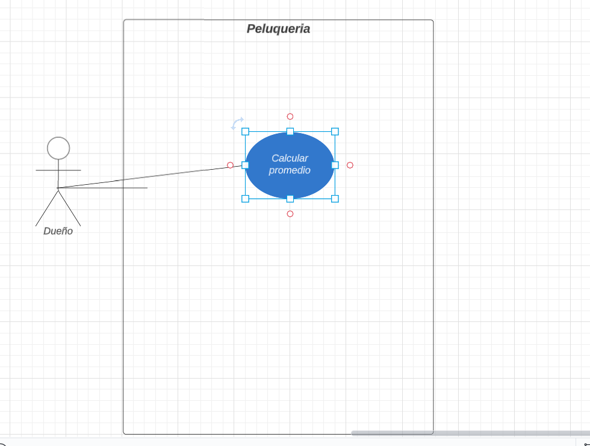
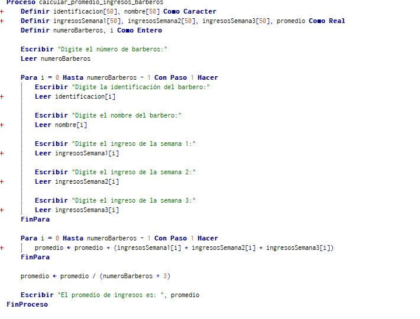
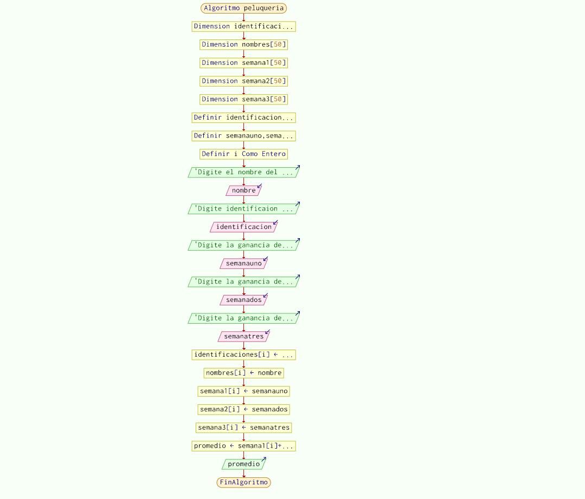

# Ejercicio Base

En su labor como programador de software ha sido elegido para el desarrollo de una aplicación que
necesita el dueño de una peluqueria, que desea calcular las ganancias de un determinado peluquero  en 3 semanas. Esta peluqueria evalúa a los
peluqueros de forma permanente y calcula el promedio general de ingresos. 

## Caso De Uso 
### Descripcion caso de uso:

**Nombre**:Calculo de promedio de ingresos peluquero.

**Actores**: Dueño Peluqueria

**Proposito**:
-Archivar el nombre e identificaion de un peluquero registrando sus ganancias en  un periodo de tres semanas.

---

### Curso normal de eventos:
1. El dueño ingresa el nombre y cedula del peluquero.

1. Se calcula el promedio:
  * Apartir de:
    * Semana 1
    * Semana 2
    * Semana 3
3. Se muestra el promedio de ingresos del peluquero(**_semana1, semana 2, semana3_**).  
_Postestipulado_:Promedio de ingresos calculado   

### Diagrama Caso De Uso 

## Presentacion Del Seudocodigo

---

## Diagrama de flujo

---

## Historia De Usuario
### _***Historia De Usuario(Epica)***_

---
### _***Historia De Usuario(Criterios De Aceptacion)***_

